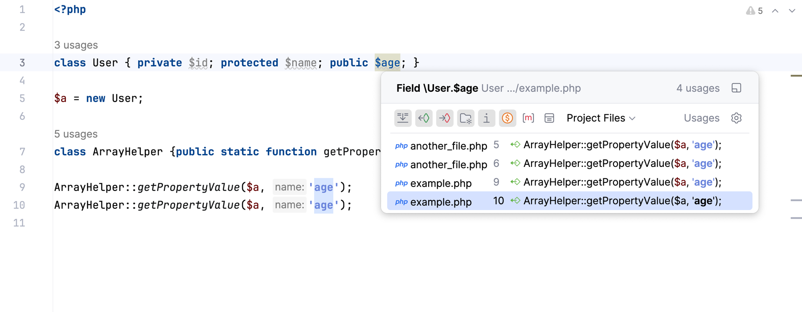
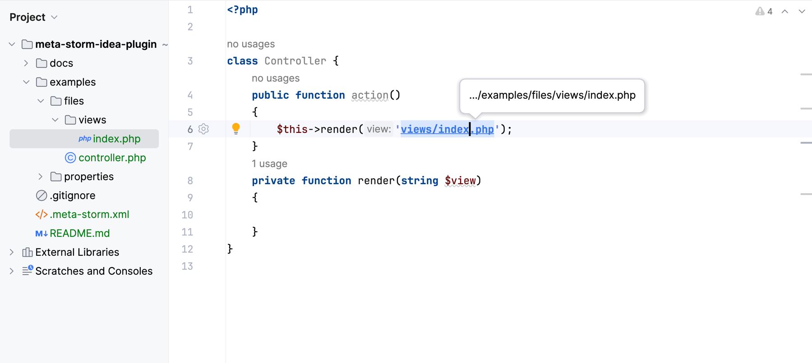
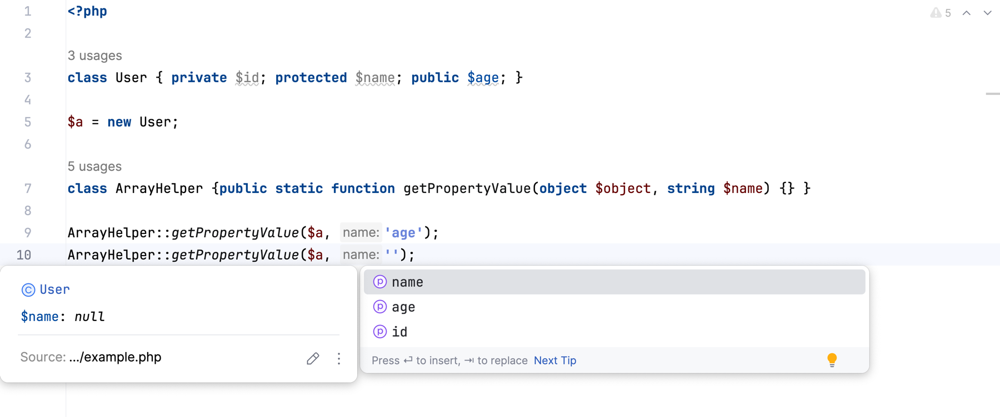
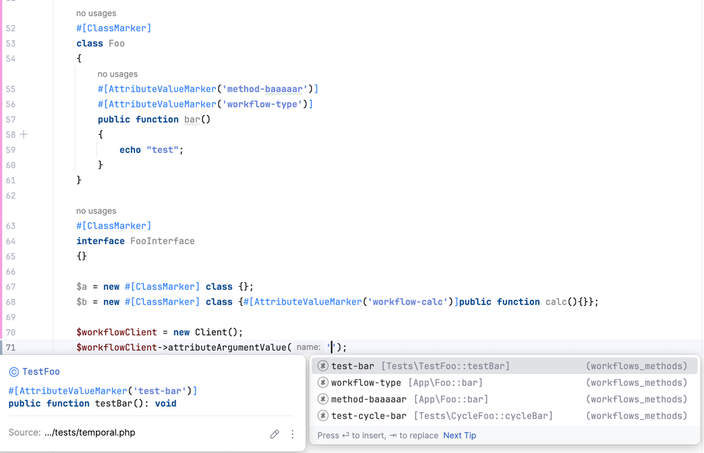
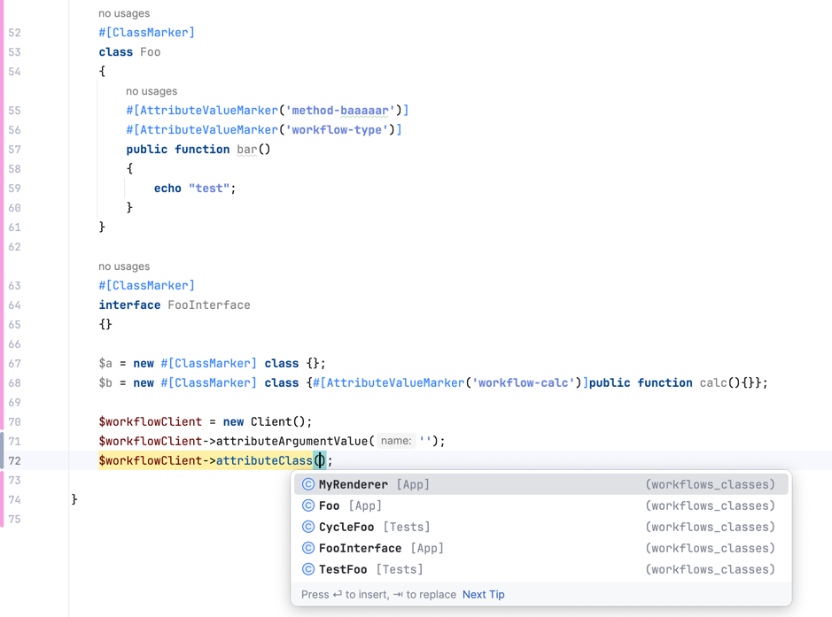

# 🌟 **MetaStorm** – Ultimate tool for PHPStorm! 🚀

[](https://plugins.jetbrains.com/plugin/26121-meta-storm)
[](https://plugins.jetbrains.com/plugin/26121-meta-storm/reviews)
[](https://plugins.jetbrains.com/plugin/26121-meta-storm/versions)

Plugin on Jetbrains Marketplace: https://plugins.jetbrains.com/plugin/26121-meta-storm/

**MetaStorm** makes your IDE understand code even deeper.

A few lines of config files unlock both **references** and **autocompletion** at regular places such as `method($object, <property of object>)`, `render(<file name>)`, etc

## Quick start

Short Youtube demo: https://youtu.be/fFGrRNFDZIg

### Goal

When I use the static method `ArrayHelper::getValue` I want to make my IDE to be as helpful as possible.

I want to make the IDE understand that if I type the second argument it must be one of the properties of the first argument:

```php
public static function getValue(object $object, string $property)
``` 


1. Create a file with the name `.meta-storm.xml` at any place in your project with the following content:

```xml
<?xml version="1.0" encoding="UTF-8" ?>
<meta-storm xmlns="meta-storm">
    <definitions>
        <classMethod class="\ArrayHelper" method="getValue" argument="1">
            <properties relatedTo="argument" relatedArgumentIndex="0"/>
        </classMethod>
    </definitions>
</meta-storm>
```

2. Create a PHP file with the following content:

```php
<?php

class User { private $id; protected $name; public $age; }

$a = new User;

class ArrayHelper {
    public static function getValue(object $object, string $property) {} 
}

ArrayHelper::getValue($a, 'age');

```

3. Start doing

- Click with pressed CTRL / COMMAND on the `'age'` and PhpStorm navigates you to the `$age` property declaration.
- Remove `age` and start typing, you can see properties completion for the existing properties.
- Click on the property `$age` in the class `User` and PhpStorm highlight you all the usages and add references to them

> That was example how it works. Read the rest documentation to understand what you can do with the plugin.

## Configuration

### Configuration files

Meta Storm searches for any files with the `.meta-storm.xml` at the end of file name so:

- A file can be placed at any place (except ignored directories)
- A file may have any name with the specific postfix, e.g.: `arrays.meta-storm.xml`, `files.meta-storm.xml`,
  `.meta-storm.xml`, etc
- Configuration files could exist more than one at the moment
- The whole config is combines with several config files

> The best way to use the plugin is to add a specific configuration to a package and distribute the config file with the
> package.

###### Empty configuration file

```xml
<?xml version="1.0" encoding="UTF-8" ?>
<meta-storm xmlns="meta-storm">
    <definitions>

    </definitions>
    <collections>

    </collections>
</meta-storm>
```

### Configuration Overview

- The configuration files are written in XML format.
- There can be any number of configuration files, as long as their names end with `.meta-storm.xml`.
- Configuration files can be distributed with libraries and may be located in the `vendor/*` directory.

Each configuration file follows this structure:

- **Definitions**
    - **Mount Point** (Where?)
        - **Functionality to Add** (What?)
            - **Display Method** (How?)
- **Collections**
    - **Collection Assembly Instructions**

Now that you understand how the configuration is structured,
you can assemble it using existing components or
submit [an issue](https://github.com/xepozz/meta-storm-idea-plugin/issues/new)
or [pull request](https://github.com/xepozz/meta-storm-idea-plugin/compare) with your idea.

### Targets

#### `classMethod`

Mounts into the class method call.

| Parameter  | Required | Description                                           | Possible values      |
|------------|----------|-------------------------------------------------------|----------------------|
| `class`    | yes      | fully qualified class name                            | `\App\Helper\Arrays` |
| `method`   | yes      | method name                                           | `getValue`           |
| `argument` | yes      | position of the argument you want to make interactive | `0`, `1`, `2`, ...   |
| children   | no       | [features](#features-overview)                        |                      | 

##### Example

```xml
<classMethod
        class="\Framework\AttributeArgumentValueInterface"
        method="attributeArgumentValue" argument="0">
    <!-- features -->
</classMethod>
```

#### `classConstructor`

Mounts into the class constructor call.

| Parameter  | Required | Description                                           | Possible values      |
|------------|----------|-------------------------------------------------------|----------------------|
| `class`    | yes      | fully qualified class name                            | `\App\Helper\Arrays` |
| `argument` | yes      | position of the argument you want to make interactive | `0`, `1`, `2`, ...   |
| children   | no       | [features](#features-overview)                        |                      | 

##### Example

```xml
<classConstructor
        class="\Framework\AttributeArgumentValueInterface"
        argument="0">
    <!-- features -->
</classConstructor>
```

#### `function`

Mounts into the function call.

| Parameter  | Required | Description                                           | Possible values     |
|------------|----------|-------------------------------------------------------|---------------------|
| `name`     | yes      | function name                                         | `file_get_contents` |
| `argument` | yes      | position of the argument you want to make interactive | `0`, `1`, `2`, ...  |
| children   | no       | [features](#features-overview)                        |                     | 

##### Example

```xml
<function name="view" argument="0">
    <!-- features -->
</function>
```

#### `returnValue`

Mounts into the returning value of the method.

| Parameter  | Required | Description                    | Possible values      |
|------------|----------|--------------------------------|----------------------|
| `class`    | yes      | fully qualified class name     | `\App\Helper\Arrays` |
| `method`   | yes      | method name                    | `getValue`           |
| children   | no       | [features](#features-overview) |                      | 

##### Example

```xml
<returnValue class="\ActiveRecord" method="tableName">
  <!-- features -->
</returnValue>
```

### Features Overview

Once you configured target it's possible to inject one or many features into the mounting point.

Many of the following features automatically enable the following IDE abilities: 
- Autocompletion
  - When you start typing inside the string literal IDE suggest you necessary endings
- Referencing string literals as program language entities that automatically enables:
    - Navigating from the usage to the definition
        - From `method('prop')`  to `class { public $prop }`
        - From `render('index')`  to `templates/site/index.php`
    - Navigating from the definition to the usages
        - Vise-serve of the navigating from the usage to the definition
    - Renaming
    - Refactoring
    - Finding usages

#### `properties`

Provide properties of the related class.

| Parameter              | Required | Description                                                | Possible values                |
|------------------------|----------|------------------------------------------------------------|--------------------------------|
| `relatedTo`            | yes      | relative point to lookup for entries                       | See [Related type](#relatedto) |
| `relatedArgumentIndex` | yes      | related argument index, useful for many `relatedTo` values | `0`, `1`, `2`, ...             |
| `public`               | yes      | show or hide such properties                               | `true`, `false`                |
| `protected`            | yes      | show or hide such properties                               | `true`, `false`                |
| `private`              | yes      | show or hide such properties                               | `true`, `false`                |
| `static`               | yes      | show or hide such properties                               | `true`, `false`                |
| children               | no       | feature processors                                         |                                | 

##### Example

```xml
<properties relatedTo="argument" relatedArgumentIndex="0" />
```

#### `methods`

Provide properties of the related class.

| Parameter              | Required | Description                                                | Possible values                |
|------------------------|----------|------------------------------------------------------------|--------------------------------|
| `relatedTo`            | yes      | relative point to lookup for entries                       | See [Related type](#relatedto) |
| `relatedArgumentIndex` | yes      | related argument index, useful for many `relatedTo` values | `0`, `1`, `2`, ...             |
| `public`               | yes      | show or hide such methods                                  | `true`, `false`                |
| `protected`            | yes      | show or hide such methods                                  | `true`, `false`                |
| `private`              | yes      | show or hide such methods                                  | `true`, `false`                |
| `abstract`             | yes      | show or hide such methods                                  | `true`, `false`                |
| `static`               | yes      | show or hide such methods                                  | `true`, `false`                |
| children               | no       | feature processors                                         |                                | 

##### Example

```xml
<methods relatedTo="current_class" static="false" />
```

#### `files`

Provide files and directories at the related filesystem point.

| Parameter   | Required | Description                                                    | Possible values                    |
|-------------|----------|----------------------------------------------------------------|------------------------------------|
| `relatedTo` | yes      | relative point to lookup for entries                           | See [Related type](#relatedto)     |
| `fileExt`   | yes      | file extension you want to filter and hide from autocompletion | `(empty)`, `php`, `blade.php`, ... |
| children    | no       | feature processors                                             |                                    | 

##### Example

```xml
<files fileExt="" relatedTo="directory"/>
```

##### Processors

`directoryProcessors` is applied here as the children element.

#### `tables`

Provide database table names.

| Parameter   | Required | Description                                                    | Possible values                    |
|-------------|----------|----------------------------------------------------------------|------------------------------------|
| children    | no       | feature processors                                             |                                    | 

##### Example

```xml
<tables />
```

#### `collection`

Provide value from the [defined collections](#collections)

| Parameter  | Required | Description                                           | Possible values              |
|------------|----------|-------------------------------------------------------|------------------------------|
| `name`     | yes      | collection name                                       | `tags`, `cycle/orm:entities` |
| `argument` | yes      | position of the argument you want to make interactive | `0`, `1`, `2`, ...           |
| children   | no       | feature processors                                    |                              | 

##### Example

```xml
<collection name="workflows_methods" argument="0" />
```

### Collections

Using collections helps to first define a set of values, prepare, filter and then use as definitions.

Collections can be merged. So it's possible to build a collection with different sources (attributes, yaml, json, php).


#### `attributeClass`

Collects **attribute** from the attribute usage.

| Parameter  | Required | Description                                  | Possible values              |
|------------|----------|----------------------------------------------|------------------------------|
| `name`     | yes      | collection name                              | `tags`, `cycle/orm:entities` |
| `class`    | yes      | fully qualified attribute class name         | `\Attributes\AsCommand`      |
| `argument` | yes      | position of the argument you want to collect | `0`, `1`, `2`, ...           |
| children   | no       | feature processors                           |                              | 

##### Example

```xml
<attributeArgument name="workflows_methods" argument="0" />
```

#### `attributeArgument`

Collects **argument** from the attribute usage.

| Parameter  | Required | Description                                  | Possible values              |
|------------|----------|----------------------------------------------|------------------------------|
| `name`     | yes      | collection name                              | `tags`, `cycle/orm:entities` |
| `class`    | yes      | fully qualified attribute class name         | `\Attributes\AsCommand`      |
| children   | no       | feature processors                           |                              | 

##### Example

```xml
<attributeArgument name="workflows_methods" argument="0" />
```

### Other

##### `relatedTo`

- Complex parameter changes interpretation of the files
- Possible values:
    - `file` – related to the current (opened) file
    - `current_class` – related to the current (opened) class
    - `directory` – related to the current file directory
    - `project` – related to the project path
    - `argument` – related to the positioned argument: it's `$obj` in `$service->method($obj, $prop)`
    - `variable` – related to the variable holding the method: it's `$service` in `$service->method()`

### Processors

#### `regexp`

- Regular expression based processor, helps you to change directory, convert camelCase to snake_case and other
- Parameters:
    - `from`: **required**
        - Regular expression
    - `to`: **required**
        - Regular expression, could you $1, $2, etc as group references
- Example: `<regexp from="([a-z])([A-Z])" to="$1-$2"/>` – converts `HelloWorld` to `Hello-World`

#### `append`

- Such prefixing basically used for some static values like static path from the project directory
- Parameters:
    - `value`: **required**
        - String
- Example: `<append value="/common/mail"/>`

## XSD Scheme

The plugin for PhpStorm natively adds support of XSD scheme, but if you want to look at it deeper please open
the [link](docs/config-scheme.xsd).

### Screenshots

##### references






##### autocomplete



##### collections



