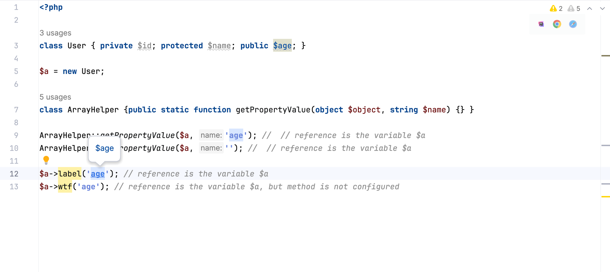

# 🌟 **MetaStorm** – Ultimate tool for PHPStorm! 🚀

Plugin on Jetbrains Marketplace: https://plugins.jetbrains.com/plugin/26121-meta-storm/

**MetaStorm** makes your IDE understand code even deeper.

A few lines of config files unlock both **references** and **autocompletion** at regular places such as `method($object, <property of object>)`, `render(<file name>)`, etc

## Advantages

- No need dedicated IDE plugin to support your own framework
- Anyone can extend or override plugin functionality
- So if a feature is not ready by the dedicated IDE plugin, MetaStorm is ready to covers with its possibilities
- No need to support legacy codebase in the dedicated IDE plugin
- Written component config might be used with any other projects, like Symfony Console and almost the whole PHP world
- Life save for single developers, any library configuration might improve developer experience with less knowledge
- Totally free

## Quick start

Short Youtube demo: https://youtu.be/fFGrRNFDZIg

Documentation: https://xepozz.github.io/meta-storm-idea-plugin

## Donation

Open-source tools can greatly improve workflows, helping developers and businesses save time and increase revenue. 
Many successful projects have been built on these tools, benefiting a wide community. 
However, maintaining and enhancing these resources requires continuous effort and investment. 

Support from the community helps keep these projects alive and ensures they remain useful for everyone. 
Donations play a key role in sustaining and improving these open-source initiatives.

Chose the best option for you to say thank you:

[ Patreon](https://patreon.com/xepozz)
|
[ Buy me a coffee](https://buymeacoffee.com/xepozz) 
|
[ Boosty](https://boosty.to/xepozz) 

### Screenshots

##### references

##### autocomplete

##### collections

