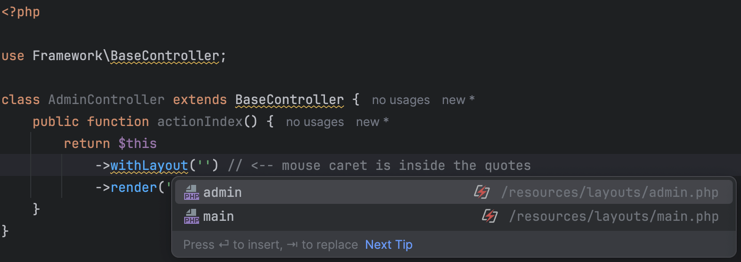

What is MetaStorm?

If you use PHPStorm, you probably rely on various plugins to help with code navigation, autocompletion, references, etc.
But what if you could define how the IDE understands your code—without depending on separate plugins for each framework?

MetaStorm is a tool that lets you do exactly that. 

Instead of waiting for specific plugins to support your framework, library or just a code snippet, 
you can describe how your code should behave inside the IDE.

This means you can achieve the following features with just a few lines of MetaStorm configuration:

- ✅ Code completion
- ✅ References navigation

### Example

Let's jump in the expressive example.

Imagine that we have kind of following files structure:

```
@root
  - resources
    - layouts
      - admin.php
      - main.php
    - views
  - src
    - Controllers
      - AdminController.php
```

### Use-case

Suggest users available layouts when they try to change it with `withLayout()` method.

### Code example

```injectablephp
<?php

use Framework\BaseController;

class AdminController extends BaseController {
    public function actionIndex() {
        return $this
            ->withLayout('<caret>') // <-- mouse caret is inside the quotes
            ->render('index');
    }
}
```

Calling code completion I want to IDE suggested me `admin` and `main` words.

Why so? 
Because in context of "layout" there are only 2 possible values: admin or main.

These values are given from the files:
- Inside the directory: `@root/resources/layouts`
- Without extension `.php`

Nothing more.

### Configuration

```xml
<?xml version="1.0" encoding="UTF-8" ?>
<meta-storm xmlns="meta-storm">
    <definitions>
        <classMethod class="\Framework\BaseController" method="withLayout" argument="0">
            <files xpath="$project/resources/layouts" extension="php" />
        </classMethod>
    </definitions>
</meta-storm>
```

### Result




## Conclusion

This is just the tip of the iceberg when it comes to what MetaStorm can do. 

In the upcoming posts, I will reveal more features, so stay tuned for updates!
